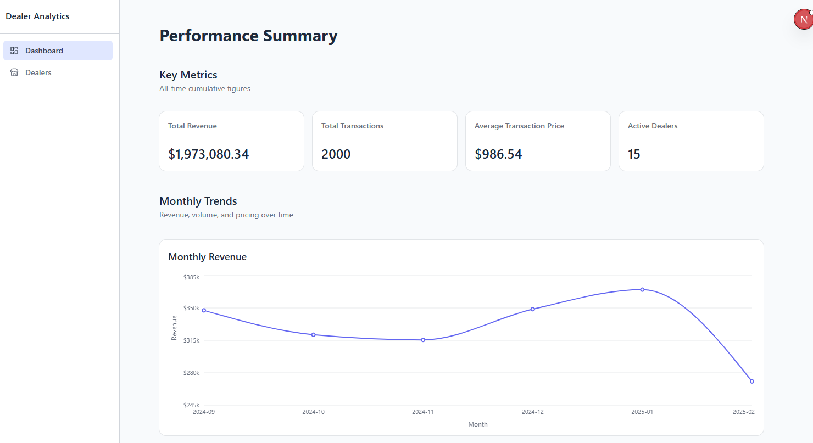
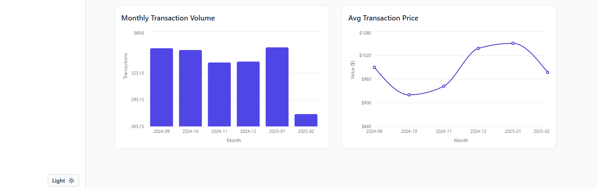
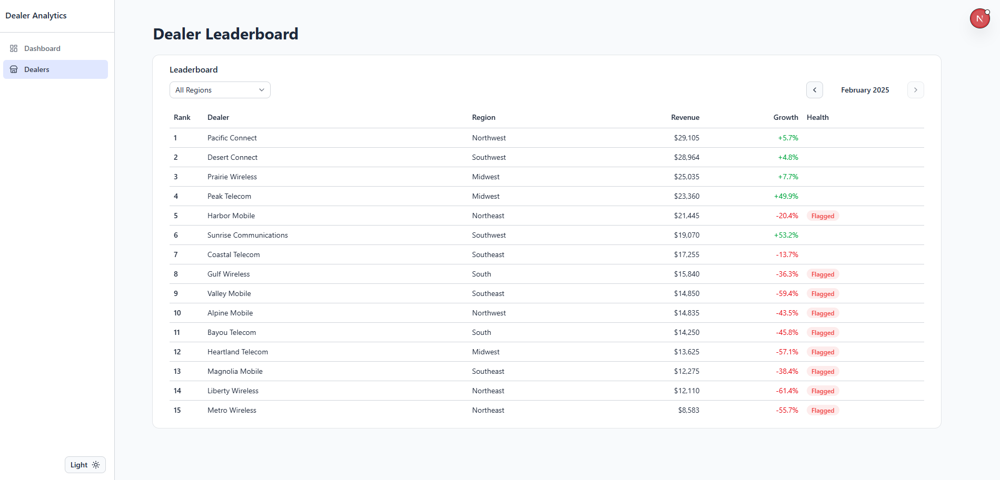

# Dealer Performance Analytics Portal

- Injests SQL data into raw transactions DB (simulated with seed script) →
- SQL-based ELT transformations
- Dashboard to display mart data and insights.

## UI

### Main Dashboard

All-time metrics for total revenue, total transactions, etc. Monthly trend charts showing how revenue/volume/price have changed.





### Dealer Leaderboard

See how dealers rank for each month as well as their MoM growth, with performance flags for those under -20% growth.



## Stack

- **Database:** PostgreSQL (hosted on Neon)
- **API:** Python FastAPI
- **Portal:** Next.js + TypeScript + Tailwind

## Running Locally

### Database

1. Setup a new PostgreSQL Database (I used [Neon](https://neon.com/) for this)
2. Create a file named `.env` in `api/` and store the connection string from the new DB as `DATABASE_URL`. Also add `ALLOWED_ORIGINS=http://localhost:3000`
3. SQL files are in `database/`. Run them in order (01, 02, ...) against your database (can do in Neon via the SQL Editor).

### API

```bash
cd api
source venv/bin/activate
uvicorn main:app --reload --port 8000
```

### Portal

Create a file named `.env.local` in `portal/` with `DEALER_PORTAL_API_BASE=http://localhost:8000`

```bash
cd portal
npm run dev
```

Portal runs on http://localhost:3000, API on http://localhost:8000.
